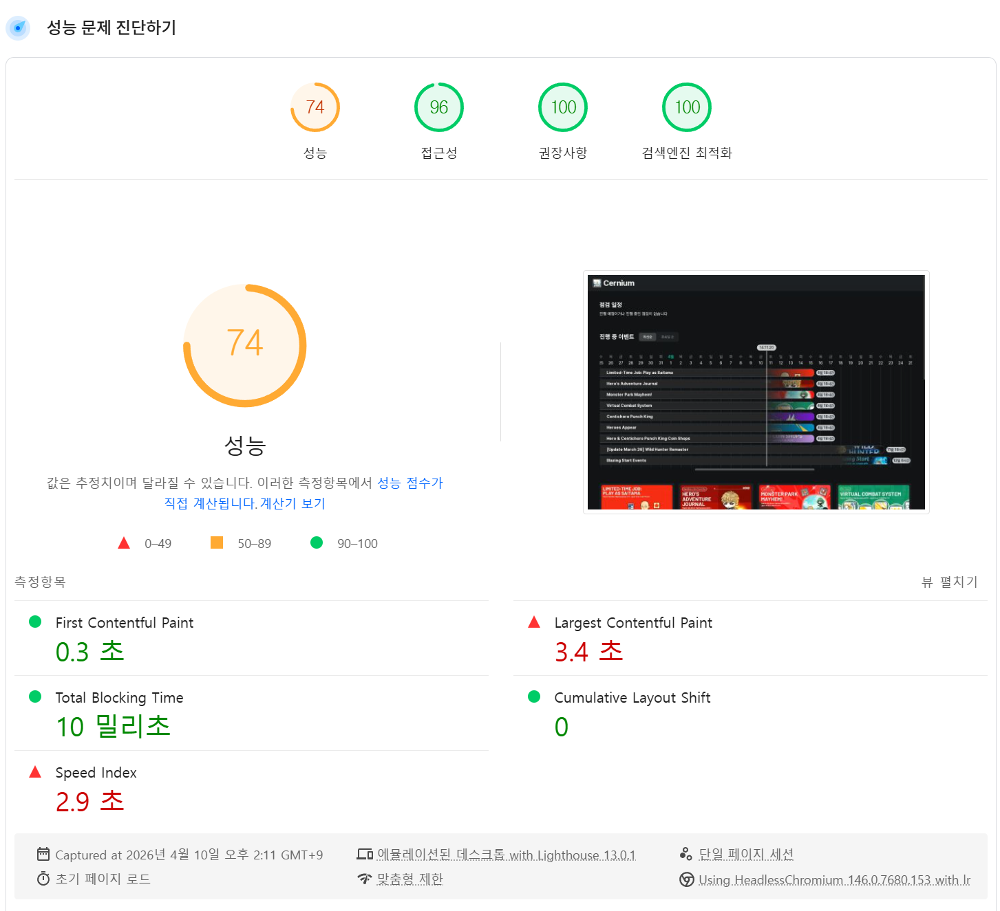
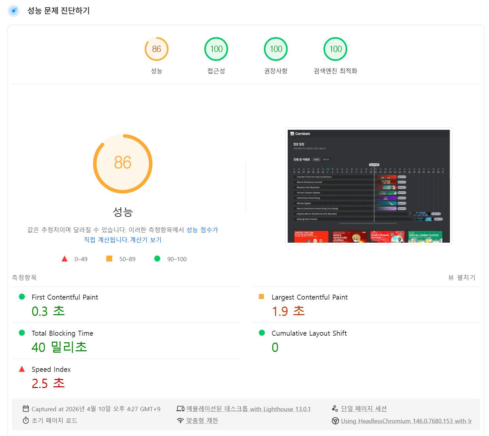

# Cernium

<br />

## 📌 개요

Cernium은 GMS(글로벌 메이플스토리) 공지 데이터를 한 화면에서 다시 읽기 좋게 정리해 보여주는 웹 서비스입니다. 점검 일정, 진행 중 이벤트, 일반 뉴스 공지를 시간은 KST로, 언어는 한국어 기준으로 재가공하고 Game Version 선택(all / gms / classic)에 따라 화면에 보여줄 데이터를 나눠서 제공합니다.

**참여 인원** : 1인

**기간** : 2026.03 ~ 꾸준한 업데이트

**Live** : https://cernium.app/


<br />

## 🤔 개발 동기

GMS 공지는 영어와 해외 시간대(UTC, PDT) 기준으로 제공되어 한국 유저가 점검 일정과 이벤트 기간을 직관적으로 파악하기 어렵고 공식 홈페이지 게시글은 필터링을 지원하지 않아 진행중인 이벤트를 파악하기 위해 커뮤니티 글에 의존해야 하는 경우가 많았습니다 저는 이런 불편을 줄이기 위해 공식 공지 데이터를 수집 정리해 적재하고 서비스에서는 이를 KST 기준으로 재가공해 진행 중인 이벤트, 점검 일정, 주요 뉴스와 한글 요약을 한 화면에서 빠르게 확인할 수 있도록 구성했습니다

<br />

## ✨ 주요 기능

**Game Version 선택**

- 메인 화면 최상단 셀렉터에서 all, gms, classic 중 하나를 고를 수 있습니다.
- 선택값은 쿠키(game_version)에 저장되어 새로고침 이후에도 유지됩니다.
- is_mscw 값을 기준으로 이벤트, 점검, 뉴스 데이터를 필터링합니다.

<br />

**점검 일정 추적**

- 현재 진행 중이거나 예정된 서버 점검만 추려서 표시합니다.
- 점검 진행중 / 점검 예정 상태를 색상으로 구분합니다.
- 점검 시작·종료 시각을 한국 시간(KST) 기준으로 표시합니다.
- 공식 공지 페이지로 바로 이동할 수 있습니다.

<br />

**진행 중 이벤트 타임라인**

- 현재 시각을 기준으로 진행 중인 이벤트를 가로 타임라인 차트로 시각화합니다.
- 현재 날짜 기준 ±40일 범위를 한눈에 확인할 수 있습니다.
- 실시간 수직선으로 지금 이 순간의 위치를 표시합니다.
- 각 이벤트 막대 옆에 남은 시간(일, 시간, 분) 배지를 함께 보여줍니다.
- 이벤트 썸네일 이미지를 배경 레이어로 깔아 빠르게 구분할 수 있습니다.

<br />

**이벤트 카드 그리드**

- 진행 중 이벤트를 카드 형태로 나열합니다.
- 최신순 / 종료일 빠른 순 정렬 토글을 지원합니다.
- 카드 클릭 시 GMS 공식 이벤트 페이지로 이동합니다.
- 한글 요약 + 전체 번역 버튼으로 마크다운 모달을 열어 한국어로 번역된 내용을 읽을 수 있습니다.

<br />

**뉴스 카드 그리드**

- 이벤트와 점검 공지를 제외한 최신 공지를 카드 형태로 나열합니다.
- 게시일을 한국 시간(KST) 기준으로 표시합니다.
- 최근 6일 이내 공지에는 NEW 배지를 표시합니다.
- 한글 요약 버튼으로 모달을 열어 마크다운 모달을 열어 한국어로 요약된 내용을 읽을 수 있습니다.

<br />

## 🛠️ 기술 스택

| 분류          | 사용 기술                                |
| ------------- | ---------------------------------------- |
| 프레임워크    | Next.js 16 (App Router)                  |
| UI            | React 19, Tailwind CSS 4, @base-ui/react |
| 언어          | TypeScript 5                             |
| 데이터베이스  | Supabase (PostgreSQL)                    |
| 날짜/시간     | @js-temporal/polyfill (TC39 Temporal)    |
| 마크다운      | react-markdown, remark-gfm               |
| 테스트        | Vitest                                   |
| 배포/분석     | Vercel, @vercel/analytics                |
| 이미지 최적화 | Cloudinary Fetch URL                     |

<br />

## 🏗️ 아키텍처

```text
공식 GMS 공지
  ↓ 외부 수집 / 정규화 / 번역
gms-tracker
  ↓
Supabase (events_v2, maintenance_v2, news)
  ↓ 데이터 변경
Webhook -> /api/revalidate?secret=
  ↓
revalidateTag(events_v2 / maintenance / news)
  ↓
Next.js 서버 컴포넌트
  ├─ cookies() -> game_version
  ├─ MaintenanceServer
  ├─ EventServer
  └─ NewsServer
  ↓
KST 변환 / 진행 상태 계산 / is_mscw 필터링
  ↓
점검 일정, 타임라인, 진행 중 이벤트, 뉴스 렌더링
```

- 공식 공지 데이터는 [gms-tracker](https://github.com/carokann1945/gms-tracker)에서 수집, 정규화, 번역한 뒤 Supabase에 적재합니다.
- 이 앱은 `events_v2`, `maintenance_v2`, `news` 테이블을 조회하고, `EVENT_CACHE_TAG`, `MAINTENANCE_CACHE_TAG`, `NEWS_CACHE_TAG`를 기준으로 캐시를 관리합니다.
- 데이터가 갱신되면 `/api/revalidate`가 `events_v2`, `maintenance`, `news` 태그를 함께 무효화해 화면에 최신 데이터를 반영합니다.
- 메인 페이지는 서버 컴포넌트에서 데이터를 불러온 뒤 KST 변환, 진행 여부 계산, `is_mscw` 기반 게임 버전 필터링을 적용하고 UI에 필요한 형태로 가공합니다.
- 이벤트/뉴스 상세 모달과 정렬, 선택기 같은 상호작용은 얇은 클라이언트 컴포넌트에서 담당합니다.

<br />

## 🧩 프로젝트 구조

```text
src/
├── app/                     # 페이지, 레이아웃, 로딩 UI, 라우트 핸들러, 공용 훅
│   ├── api/revalidate/      # On-Demand Revalidation 엔드포인트
│   └── hooks/               # 브라우저 히스토리 기반 모달 훅
├── components/
│   ├── layout/              # 공통 헤더·푸터·네비게이션
│   └── markdown/            # 마크다운 렌더러
├── constants/               # 시간 표기 상수
├── features/
│   ├── event/               # 진행 중 이벤트 타임라인, 카드, 모달
│   ├── game-version/        # 버전 선택, 쿠키, 서버 액션
│   ├── maintenance/         # 점검 일정 조회 및 상태 계산
│   └── news/                # 뉴스 카드, 요약 모달
└── lib/
    ├── cloudinary/          # Cloudinary Fetch URL 변환
    └── supabase/            # Supabase 클라이언트
```

<br />

## 🧩 로컬 실행 방법

### 1. 사전 준비

- Node.js 24.x 권장 (현재 검증 환경: v24.14.0)
- pnpm 10.x 권장 (현재 검증 환경: 10.33.0)
- 실제 화면 확인과 프로덕션 빌드를 위해 유효한 Supabase 프로젝트가 필요합니다.

<br />

### 2. 저장소 클론

```bash
git clone https://github.com/carokann1945/cernium
cd cernium
```

<br />

### 3. 패키지 설치

```bash
pnpm install
```

<br />

### 4. 환경변수 설정

`.env.example`을 복사해 `.env.local` 파일을 생성한 뒤 값을 채워 넣습니다.

```bash
cp .env.example .env.local
```

- `NEXT_PUBLIC_SUPABASE_URL`: Supabase 프로젝트 URL
- `NEXT_PUBLIC_SUPABASE_ANON_KEY`: Supabase anon public key
- `REVALIDATION_SECRET`: `/api/revalidate` 호출 시 사용하는 secret
- `NEXT_PUBLIC_CLOUDINARY_CLOUD_NAME`: Cloudinary Fetch URL 생성에 사용하는 cloud name

`NEXT_PUBLIC_CLOUDINARY_CLOUD_NAME`이 없으면 원본 썸네일 URL을 그대로 사용합니다.

<br />

### 5. Supabase 준비

메인 화면을 정상적으로 확인하려면 아래 테이블이 동일한 스키마로 준비되어 있어야 합니다.

- `events_v2`: 진행 중 이벤트 목록과 타임라인 렌더링에 사용하는 테이블  
  핵심 컬럼: `id`, `name`, `is_mscw`, `live_date`, `start_at`, `end_at`, `gms_url`, `image_thumbnail`, `summary`
- `maintenance_v2`: 점검 일정 렌더링에 사용하는 테이블  
  핵심 컬럼: `id`, `name`, `is_mscw`, `live_date`, `start_at`, `end_at`, `url`
- `news`: 뉴스 카드와 요약 모달 렌더링에 사용하는 테이블  
  핵심 컬럼: `id`, `created_at`, `name`, `is_mscw`, `live_date`, `url`, `image_thumbnail`, `translation`

`is_mscw`는 `Game Version` 필터링 기준으로 사용합니다.

README에는 SQL 원문을 넣지 않았고, 로컬 실행 시에는 위 구조와 동일한 테이블이 준비되어 있으면 됩니다.

<br />

### 6. 개발 서버 실행

```bash
pnpm dev
```

브라우저에서 `http://localhost:3000`으로 접속합니다.

<br />

### 7. 검증 명령어

```bash
pnpm lint
pnpm test
pnpm build
```

- `pnpm lint`: ESLint 기반 정적 분석
- `pnpm test`: 이벤트·점검·뉴스 로직, 서버 렌더링, 게임 버전 쿠키/액션, 메인 페이지 조합 흐름 검증
- `pnpm build`: 프로덕션 빌드 확인

`pnpm lint`, `pnpm test`는 외부 데이터 없이 실행할 수 있습니다 `pnpm dev`, `pnpm build`는 Supabase 환경변수와 데이터가 준비되어 있어야 실제 화면 기준으로 검증할 수 있습니다.

<br />

## 🧪 테스트

현재 테스트는 시간 계산과 상태 판별처럼 사용자 신뢰도에 직접 영향을 주는 로직을 우선 검증하는 데 집중합니다. GMS 공지를 KST로 바꿔 보여주는 과정에서 시작 시각, 종료 시각, 진행 여부가 조금만 어긋나도 실제 일정과 다른 정보를 보여주게 되기 때문에, 날짜 가공과 필터링 로직을 핵심 검증 대상으로 잡았습니다.

이벤트 테스트는 진행 중 이벤트만 남기는 판별 조건, KST 기간 문자열 생성, 정렬 기준, Supabase fetch 캐시 설정, 서버 컴포넌트 렌더링을 검증합니다. 점검 테스트는 날짜 정규화, 진행중/예정 상태 계산, KST 기간 표기, 빈 상태와 에러 상태 렌더링까지 확인합니다.

뉴스 테스트는 `NEW` 판별, KST 날짜 포맷, 데이터 fetch, 최신 8개 추출, 마지막 업데이트 표기 계산을 검증합니다. 여기에 더해 `game-version` 테스트로 `all` / `gms` / `classic` 파싱과 `is_mscw` 필터 규칙, 쿠키 저장과 서버 액션 동작을 고정해 두었습니다.

마지막으로 메인 페이지 테스트에서는 쿠키에서 읽은 `gameVersion` 값이 선택기와 각 서버 컴포넌트에 모두 같은 값으로 전달되는지 확인해 화면 전체가 동일한 버전 기준으로 렌더링되는지를 검증합니다.

<br />

## ⚙️ 기술적 고민 및 트러블슈팅

1. **파편화된 해외 시간대(UTC, PDT)의 일관된 KST 렌더링**

GMS 유저들의 가장 큰 페인포인트 중 하나는 한국인에게 익숙하지 않은 복잡한 공지 시간대였습니다. 단순 문자열 처리로는 진행 상태를 파악하기 어렵다고 판단해 데이터베이스에는 원본 데이터를 UTC ISO 형태로 유지하고, 렌더링 시 서버/클라이언트에서 KST로 변환하도록 설계했습니다 덕분에 점검 일정, 이벤트 기간, 뉴스 공개일을 하나의 기준으로 안정적으로 표시할 수 있었습니다.

<br />

2. **Webhook을 활용한 On-Demand Revalidation**

이벤트, 점검, 뉴스 정보는 유저가 자주 확인하는 데이터지만 매 요청마다 원본 데이터를 다시 가져오는 것은 응답 속도와 서버 비용 측면에서 낭비였습니다. 이를 해결하기 위해 Next.js 캐시를 활용하되 평소에는 캐시된 응답을 제공하고, 데이터 변경이 일어날 때만 Webhook으로 `/api/revalidate`를 호출해 `events_v2`, `maintenance`, `news` 태그를 무효화하는 구조를 구성했습니다.

<br />

3. **정보 탐색 UX 개선과 상호작용 분리**

본문이 길고 정보가 분산된 영어 공지를 한눈에 파악하기 어렵다는 문제를 해결하기 위해 진행 중 이벤트를 타임라인 차트와 카드 리스트로 시각화하고, 이벤트/뉴스 상세 내용은 모달로 분리했습니다. 모달은 브라우저 히스토리와 연결해 뒤로가기 동작으로도 자연스럽게 닫히도록 구성했고, 데이터 조회와 가공은 서버 컴포넌트에 두고 정렬, 선택, 모달 표시 같은 상호작용만 클라이언트 컴포넌트에 남겨 경계를 명확히 나눴습니다.

<br />

4. **런칭 후 드러난 데이터 수집 한계와 기획 전환**

서비스 초기에는 6개월 앞선 KMS 이벤트를 LLM으로 매칭해 주는 기능을 기획하고 직접 구현까지 진행했습니다. 하지만 두 서버 간의 구성과 맥락 차이 탓에 매칭 정확도가 60% 수준에 그쳐 실제 유저에게 신뢰를 주기에는 무리가 있었습니다.

또 GMS 공지는 하나의 글 안에 여러 이벤트가 섞여 있는 경우가 많아, 이를 개별 이벤트 단위로 완벽히 분리해 저장하는 데에도 기술적 한계가 명확했습니다. 그래서 불완전한 매칭과 억지스러운 데이터 분리를 모두 내려놓고 공지 원문 전체를 LLM으로 한글 마크다운화해 읽기 쉽게 전달하는 방향으로 전환했습니다. 이 과정에서 공지 수집·정규화·번역 파이프라인의 실제 구현은 [gms-tracker](https://github.com/carokann1945/gms-tracker)로 분리해 관리하고, 이 저장소는 사용자 화면에 맞는 조회·가공·표시에 집중하도록 역할을 나눴습니다.

<br />

5. **전역 게임 버전 필터의 순간 불일치 문제**

처음에는 Game Version 선택을 바꿀 때 서버 액션에서 쿠키를 저장한 뒤 `redirect('/')`로 전체 페이지를 다시 그리도록 처리했습니다. 문제는 이 전환 과정에서 `loading.tsx`가 기본값인 `all` 상태처럼 렌더링하고 있었다는 점이었습니다. 그래서 사용자가 `gms`나 `classic`을 고른 직후에도 화면 상단 선택기가 잠깐 `All`로 되돌아간 것처럼 보였고, 아래 점검·이벤트·뉴스 목록도 필터가 풀린 것처럼 느껴지는 플래시가 발생했습니다.

이 현상은 전역 필터가 화면 전체 데이터의 기준점이라는 점에서 특히 거슬렸습니다. 실제 서버 상태는 곧바로 바뀌더라도, 사용자는 그 짧은 순간에 "선택이 적용되지 않았나?"라고 받아들이기 쉬웠기 때문입니다. 그래서 선택 컴포넌트에서는 로컬 optimistic 상태로 새 값을 즉시 유지하고, 서버 액션은 쿠키만 갱신한 뒤 클라이언트에서 `router.refresh()`를 호출하도록 흐름을 바꿨습니다. 동시에 `loading.tsx`에서는 더 이상 실제 선택기를 `all` 값으로 렌더링하지 않고 같은 자리에 중립적인 placeholder만 보여주도록 수정했습니다. 덕분에 전환 중에도 사용자가 고른 버전이 안정적으로 유지되어 보이게 되었고, 만약 갱신에 실패하면 이전 값으로 되돌려 UI와 서버 쿠키 상태가 어긋나지 않도록 정리할 수 있었습니다.

<br />

## ⚙️ 성능 최적화

<br />





초기 Lighthouse 측정에서는 LCP가 3.4초로 권장 지표보다 거의 1초 가까이 느렸습니다. 처음에는 마크다운 렌더링 번들이 원인이라고 보고 이벤트 상세 모달과 뉴스 상세 모달을 모두 동적 로딩 경로로 분리해 초기 번들 크기를 줄였습니다. 버튼 hover 시점에 사전 로딩되도록 구성한 것도 같은 맥락입니다.

하지만 실제로 더 큰 영향을 주고 있던 부분은 타임라인 차트의 썸네일 이미지였습니다. 처음에는 CSS `background-image`로 이미지를 표시하고 있었는데, 이 방식은 `next/image` 최적화 대상이 아니라 원본 JPG가 그대로 로드되어 LCP에 악영향을 주고 있었습니다.

그래서 각 bar의 배경 이미지를 `Image` 컴포넌트 기반으로 교체했고, 좌측 이벤트명이 sticky하게 고정되는 기존 UI를 유지하기 위해 이미지 전용 wrapper를 별도 sibling 레이어로 분리했습니다. 덕분에 시각적 구성은 유지하면서도 차트 구간의 이미지 로딩 비용을 줄일 수 있었고, 카드 그리드에서도 이미지 `sizes`를 실제 렌더링 크기에 맞게 조정할 수 있었습니다.

이 과정을 통해 단순히 번들만 줄이는 데서 끝나지 않고 실제 렌더링 병목이 어디에 있는지 다시 추적하면서 더 직접적인 최적화 포인트를 찾을 수 있었습니다. 결과적으로 LCP는 3.4초에서 1.9초로 개선되었습니다.

추가로 장식용 이미지는 `alt=""`로 처리해 스크린 리더가 불필요하게 읽지 않도록 했고, 전체적인 대비를 개선해 Lighthouse 접근성 점수를 96점에서 100점으로 끌어올렸습니다.

<br />

## 📝 최근 업데이트

2026.04.16

- 메인 화면에 News 섹션을 추가하고 이벤트, 점검을 제외한 최신 뉴스 8개를 게시일 기준 내림차순으로 노출하도록 반영했습니다.
- 최근 7일 이내 공지에 NEW 배지를 표시해 새 글을 빠르게 구분할 수 있도록 했습니다.

<br />

2026.04.18

- 메인 화면에 game version 셀렉터를 추가했습니다.

<br />
