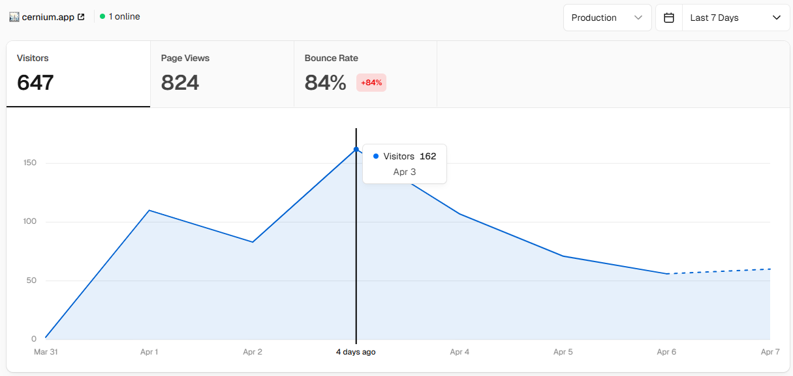

# Cernium

<br />

## 📌 개요

GMS(글로벌 메이플스토리)의 점검 일정과 진행 중 이벤트를 한 화면에서 확인하는 웹 서비스입니다. 한국인 유저를 위해 모든 시간을 KST로 환산하여 표시하며, 이벤트 공지를 한글로 번역해 제공합니다

**참여 인원** : 1인

**기간** : 2026.03 ~ 꾸준한 업데이트

**Live** : https://cernium.app/



<br />

## 🤔 개발 동기

GMS 공지는 영어와 해외 시간대(UTC, PDT) 기준으로 제공되어 한국 유저가 점검 일정과 이벤트 기간을 직관적으로 파악하기 어렵습니다. 특히 필요한 정보가 여러 공지에 흩어져 있어 커뮤니티 글에 의존해야 하는 경우가 많았습니다. 저는 이런 불편을 줄이기 위해 공식 공지 데이터를 한곳에 모아 KST 기준으로 재가공하고 진행 중인 이벤트와 점검 일정을 한 화면에서 빠르게 확인할 수 있도록 만들었습니다.

<br />

## ✨ 주요 기능

**점검 일정 추적**

- 현재 진행 중이거나 예정된 서버 점검을 실시간으로 표시합니다.
- 점검 진행중 / 점검 예정 상태를 색상으로 구분
- 점검 시작·종료 시각을 한국 시간(KST) 기준으로 표시
- 공식 공지 페이지로 바로 이동 가능

<br />

**진행 중 이벤트 타임라인**

- 현재 시각을 기준으로 진행 중인 이벤트를 가로 타임라인 차트로 시각화했습니다.
- 현재 날짜 ±40일 범위를 한눈에 확인
- 실시간 수직선으로 지금 이 순간의 위치 표시
- 각 이벤트 막대 위에 남은 시간(일·시간) 배지 표시
- 이벤트 썸네일 이미지가 막대 배경에 표시됨

<br />

**이벤트 카드 그리드**

- 진행 중인 이벤트를 카드 형태로 나열했습니다.
- 최신순 / 종료일 빠른 순 정렬 토글
- 카드 클릭 → GMS 공식 이벤트 페이지로 이동
- 요약 보기 버튼 클릭 → 마크다운 형식의 한글 번역 상세 설명 모달 팝업

<br />

## 🛠️ 기술 스택

| 분류         | 사용 기술                             |
| ------------ | ------------------------------------- |
| 프레임워크   | Next.js 16 (App Router)               |
| UI           | React 19, Tailwind CSS 4              |
| 언어         | TypeScript 5                          |
| 데이터베이스 | Supabase (PostgreSQL)                 |
| 날짜/시간    | @js-temporal/polyfill (TC39 Temporal) |
| 배포         | Vercel                                |

<br />

## 🧩 프로젝트 구조

```
src/
├── app/                     # 페이지 및 레이아웃 (Next.js App Router)
├── features/
│   ├── period-tracker/      # 진행 중 이벤트 타임라인 & 카드
│   └── maintenance-tracker/ # 점검 일정 리스트
├── components/layout/       # 공통 헤더·푸터
└── lib/supabase/            # Supabase 클라이언트
```

<br />

## 🧩 로컬 실행 방법

1. **저장소 클론**

   ```bash
   git clone https://github.com/carokann1945/cernium
   ```

<br />

2. **환경변수 설정**
   .env.local 파일을 생성하고 아래 값을 입력합니다.<br />
   ```bash
   NEXT_PUBLIC_SUPABASE_URL=your_supabase_url
   NEXT_PUBLIC_SUPABASE_ANON_KEY=your_supabase_anon_key
   REVALIDATION_SECRET=your_revalidation_secret
   ```

<br />

3. **패키지 설치**</br>
   ```bash
   pnpm install
   pnpm dev
   ```

<br />

## ⚙️ 기술적 고민 및 트러블슈팅

1. **파편화된 해외 시간대(UTC, PDT)의 일관된 KST 렌더링**

   GMS(글로벌 메이플스토리) 유저들의 가장 큰 페인포인트 중 하나는 한국인에게 익숙하지 않은 복잡한 공지 시간대였습니다. 단순 문자열 처리로는 진행 상태를 파악하기 어렵다고 판단하여 데이터베이스(Supabase)에는 원본 데이터를 UTC ISO 형태로 엄격하게 유지하고, 렌더링 시 서버/클라이언트에서 KST로 변환하도록 설계했습니다. 덕분에 점검 일정과 이벤트 기간을 하나의 일관된 기준으로 렌더링할 수 있었고 현재 진행 상태도 오차 없이 안정적으로 계산할 수 있었습니다.

<br />

2. **Webhook을 활용한 On-Demand Revalidation**

   이벤트와 점검 정보는 유저가 자주 확인하는 데이터지만 매 요청마다 원본 데이터를 다시 가져오는 것은 응답 속도와 서버 비용 측면에서 큰 낭비였습니다. 이를 해결하기 위해 Next.js의 캐싱 기능을 활용하되 평소에는 정적 캐시를 제공하고 데이터 변경이 일어날 때만 Webhook을 트리거하여 캐시를 무효화(On-Demand Revalidation)하는 구조를 구축했습니다. 결과적으로 사용자에게는 빠른 초기 응답 속도를 보장하면서도 불필요한 API 호출 비용을 최소화할 수 있었습니다.

<br />

3. **정보 탐색 UX 개선 및 렌더링 성능 최적화**

   본문이 길고 정보가 분산된 영어 공지를 한눈에 파악하기 어렵다는 문제를 해결하기위해 진행 중인 이벤트를 타임라인 차트와 카드 리스트로 시각화하고 상세 내용은 모달을 통해 한글 요약본으로 제공했습니다.
   이 과정에서 타임라인의 현재 시간이 1초마다 업데이트되며 전체 컴포넌트가 리렌더링되는 비효율이 발생했습니다. 이를 해결하기 위해 1초마다 상태가 변하는 타이머 부분만 별도의 컴포넌트로 분리하여 불필요한 리렌더링을 차단했습니다. 또한 서버 컴포넌트의 데이터 로딩 중에는 Suspense와 Skeleton UI를 스트리밍하여 사용자가 초기 로딩 상태에서 작동이 안된다는 의문을 가지지 않도록 했습니다.

<br />

4. **런칭 후 드러난 데이터 수집 한계와 기획 전환**

   서비스 초기에는 6개월 앞선 KMS 이벤트를 LLM으로 매칭해 주는 기능을 기획하고 직접 구현까지 진행했습니다. 하지만 두 서버 간의 구성과 맥락 차이 탓에 매칭 정확도가 60% 수준에 그쳐 실제 유저에게 신뢰를 주기에는 무리가 있었습니다.

   게다가 런칭 후 드러난 또 다른 고민거리도 있었습니다. 혼자 개발할때는 미처 신경쓰지 못했던 부분인데, GMS 공지는 특유의 '소제목 다중 이벤트' 형태가 많아 하나의 글에 섞인 여러 이벤트를 개별 단위로 정확히 분리해 DB에 저장하는 데 기술적 한계가 명확했습니다. 혼자 개발하면서 이 비정형 데이터를 완벽히 파싱하는 것은 힘들겠다는 생각이 들었습니다.

   이 두 가지 문제를 두고 치열하게 고민한 끝에, 불완전한 매칭과 억지스러운 데이터 분리를 모두 내려놓기로 했습니다. 대신 "어차피 유저가 원하는 건 영어 공지를 쉽게 읽는 것 아닐까?" 라는 생각으로, KMS 매칭을 제외하고 공지 원문 전체를 LLM으로 한글 마크다운화하여 번역 및 요약해 주는 기능으로 전면 대체했습니다.

   결과적으로 다중 이벤트를 억지로 쪼개려던 기술적 골칫거리도 단번에 털어내고, 유저 입장에서는 가독성 좋은 한글 공지를 볼 수 있게 되었습니다. 안 되는 것을 무리하게 붙잡고 있기보다 과감한 기획 전환으로 실제 활용도를 높인 가장 만족스러운 결정이었습니다.
