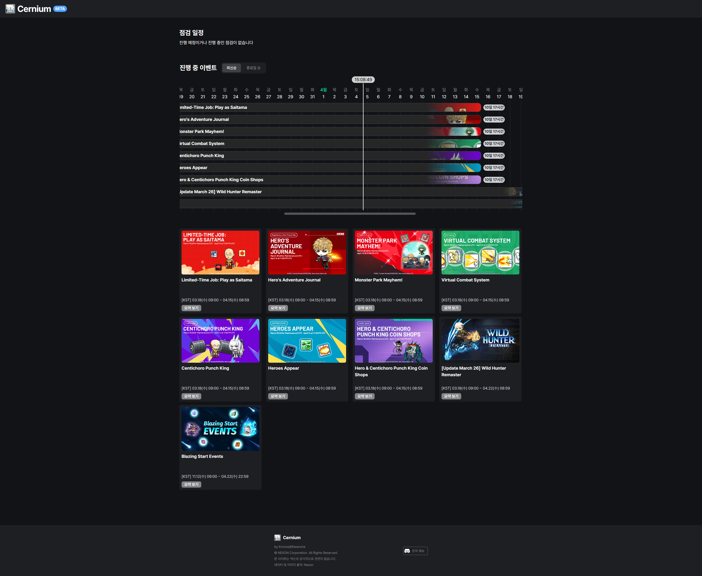
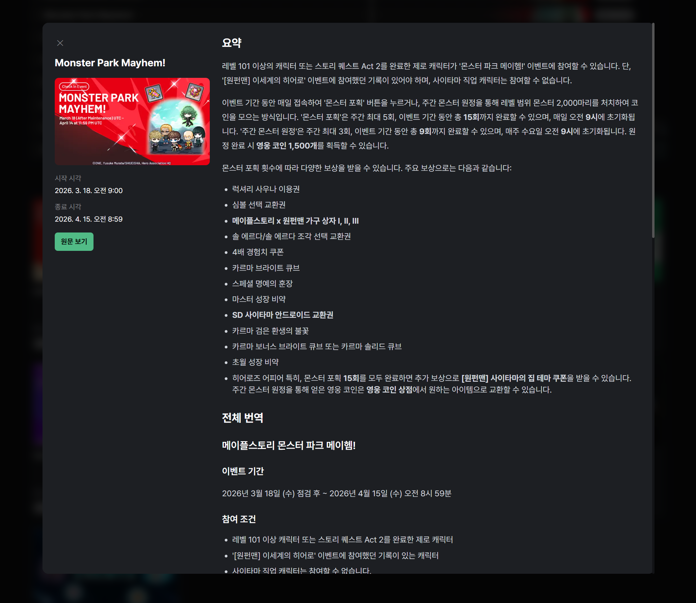

<h2 align="center">
  Cernium
</h2>

<div align="center">
  <p>GMS(글로벌 메이플스토리)의 점검 일정과 진행 중 이벤트를 한 화면에서 확인하는 웹 서비스입니다. 한국인 유저를 위해 모든 시간을 KST로 환산하여 표시하며, 이벤트 공지를 한글로 번역해 제공합니다.</p>
</div>

</br>

<p align="center">
  
  
</p>

## 배포 링크 / GitHub

- 배포 링크: https://cernium.app
- GitHub: https://github.com/carokann1945/cernium

## 주요 기능

### 1. 점검 일정 추적

현재 진행 중이거나 예정된 서버 점검을 실시간으로 표시한다.

- 점검 진행중 / 점검 예정 상태를 색상으로 구분
- 점검 시작·종료 시각을 한국 시간(KST) 기준으로 표시
- 공식 Nexon 공지 페이지로 바로 이동 가능

### 2. 진행 중 이벤트 타임라인

현재 시각을 기준으로 진행 중인 이벤트를 가로 타임라인 차트로 시각화한다.

- 현재 날짜 ±40일 범위를 한눈에 확인
- 실시간 수직선으로 지금 이 순간의 위치 표시
- 각 이벤트 막대 위에 남은 시간(일·시간·분) 배지 표시
- 이벤트 썸네일 이미지가 막대 배경에 표시됨

### 3. 이벤트 카드 그리드

진행 중인 이벤트를 카드 형태로 나열한다.

- 최신순 / 종료일 빠른 순 정렬 토글
- 카드 클릭 → Nexon 공식 이벤트 페이지로 이동
- 요약 보기 버튼 클릭 → 마크다운 형식의 한글 번역 상세 설명 모달 팝업

## 기술 스택

| 분류         | 사용 기술                             |
| ------------ | ------------------------------------- |
| 프레임워크   | Next.js 16 (App Router)               |
| UI           | React 19, Tailwind CSS 4              |
| 언어         | TypeScript 5                          |
| 데이터베이스 | Supabase (PostgreSQL)                 |
| 날짜/시간    | @js-temporal/polyfill (TC39 Temporal) |
| 배포         | Vercel                                |

## 프로젝트 구조

```
src/
├── app/                    # 페이지 및 레이아웃 (Next.js App Router)
├── features/
│   ├── period-tracker/     # 진행 중 이벤트 타임라인 & 카드
│   └── maintenance-tracker/# 점검 일정 리스트
├── components/layout/      # 공통 헤더·푸터
└── lib/supabase/           # Supabase 클라이언트
```
